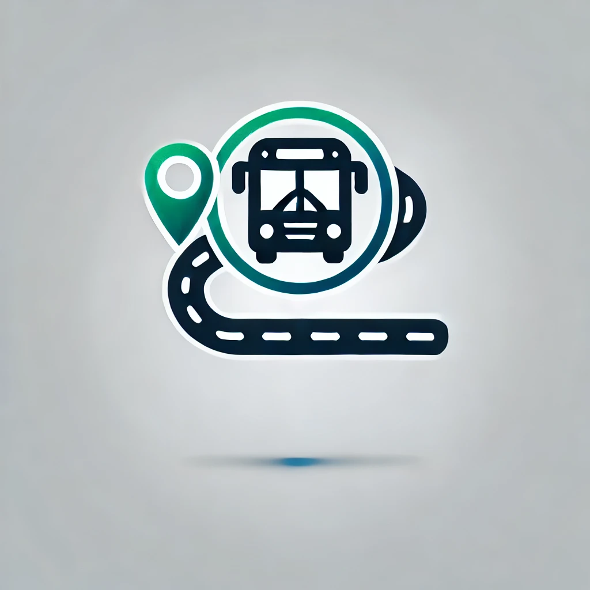

# Smart Route (🇵🇱)

## What is the Smart Route project?

Smart Route is a project that we are developing within the [Next Level Dev](./docs/next-level-dev/README.md) community. The aim of the project is to create a place where programmers interested in the project will be able to practice their skills. It's mainly about developing oneself as a programmer in terms of programming, infrastructure (DevOps etc.), or project management itself.

The Smart Route project itself is a copy of the idea from [jakdojade.pl](https://jakdojade.pl/onboarding). Our goal is to create a simple app that allows the user to check the timetable of a selected means of urban transportation, verify how long the journey from one stop to another will take, or plan the entire journey from point A to point B. For this purpose, we rely on the API provided by the [Warsaw City Hall](https://api.um.warszawa.pl/#). The current scope of work is outlined in the [MVP section](#mvp).

## How to join/contribute?

The most important step is to join the dedicated [Discord channel](https://discord.com/invite/gTCCHagd9a). Afterward, you must provide your GitHub username to be added to the organization. Only then will you be able to actively participate in the project.

## Technical assumptions

Currently we decided to use such technologies:

- Java/Kotlin,
- Spring.

Of course, we are not limited to use only above-mentioned technologies. It is welcomed to add there CI/CD tools, frontend, Docker and so on. Sky is the limit!

## MVP

We aim to provide an application for Warsaw in the first phase.

1st milestone:
- [ ] Integration with the Warsaw Public Transport API (https://api.um.warszawa.pl/) - real-time location of buses and trams.
- [ ] User's search history of routes.
- [ ] Selection of a route from search history and search for it again.
- [ ] Selection of a route from search history and its reversal.
- [ ] Displaying the most frequently searched route from the last hour/24 hours among searches throughout the entire application.
- [ ] Calculating time for the searched route.
- [ ] Searching for a route with the possibility of stopping at selected places along the way.
- [ ] Planning a route consisting of n points and adding the amount of time I will spend at each point will allow the application to calculate how long the entire journey will take.
- [ ] Change the time that I spend at a given point, and let the app recalculate for me how long the entire trip will take and which connections I should use.
- [ ] Planning trips to parks, museums, or other places. I would like the application to show me how to move between them.
- [ ] Planning a route between n points, taking into account the fact that I want to walk between m of them.
- [ ] Basic route search (start, destination, time optimization).
- [ ] Search history + ability to re-search routes.
- [ ] Reversing the route (from A → B to B → A).
- [ ] Estimated travel time (based on communication data).

Draft of "nice to haves":
- [ ] Planning group trips (e.g. friends meet in one place, and the system plans optimal routes for everyone).
- [ ] Trip planning - AI generates ready-made trip plans, taking into account the user's preferences (e.g. visiting museums, dining at restaurants etc.).
- [ ] Integration with weather data (e.g. OpenWeatherAPI) and events.
- [ ] Integration with systems such as, for example, Veturilo or electric scooters.
