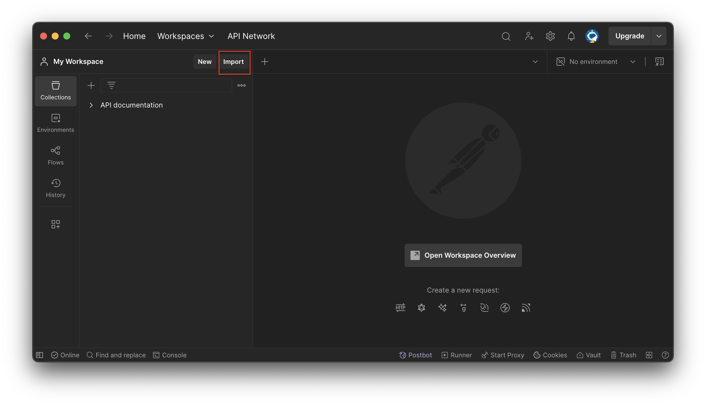
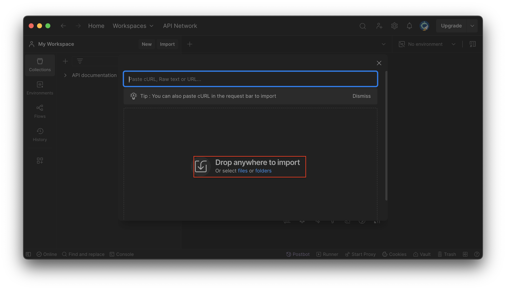
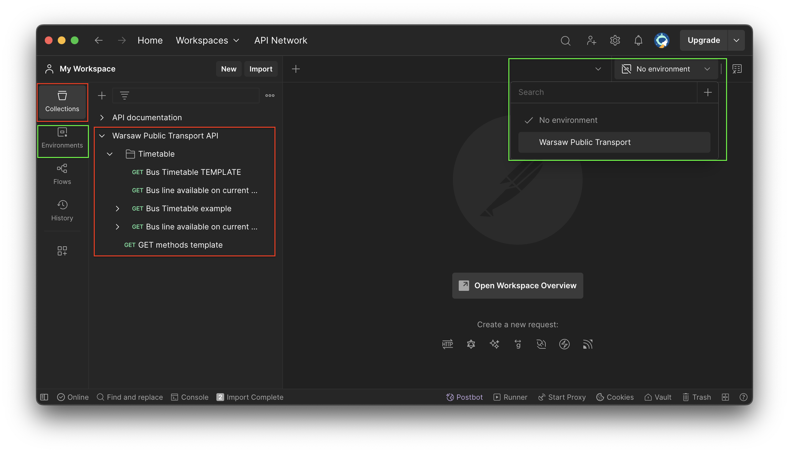
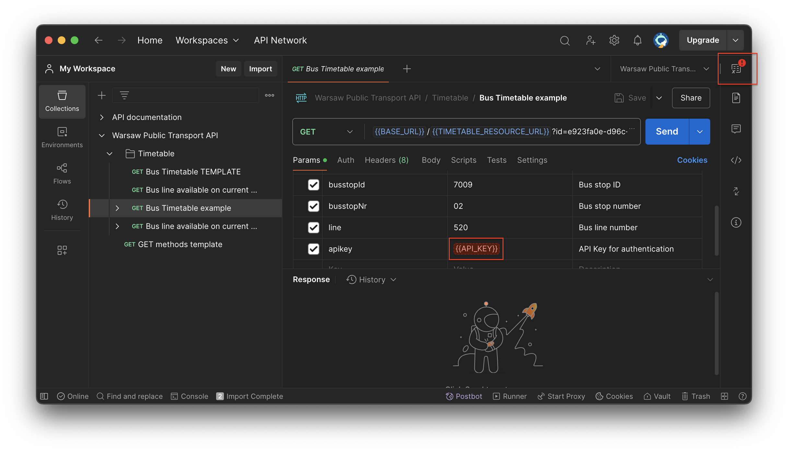
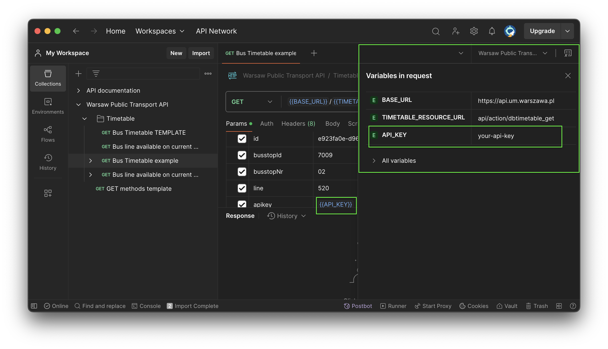
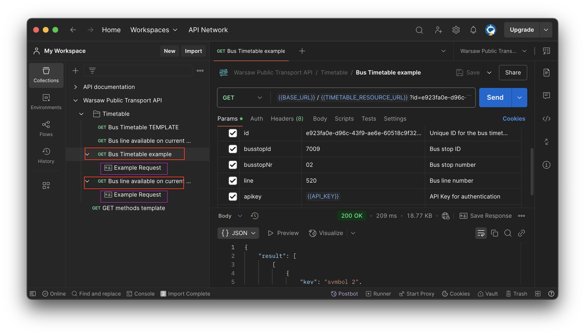

## Postman Collection Import Readme

This repository contains a Postman collection for interacting with the Warsaw Public Transport API.  
It provides requests to fetch bus timetables, available bus lines, and other transport-related data.

### 🚀 Getting Started  

1️⃣ Importing the Collection

- Open Postman.
- Click Import. 
- Select each .json type file from addons/postman/ directory or choose import whole current folder. 

2️⃣ Setting Up Environment Variables  

After that you should have get prepared Warsaw Public Transport API collection.

The environment file (API_UM_Warsaw-env.json) contains predefined variables required for API requests.
After importing, ensure that the environment is selected in Postman:

Click on the Environment selector (top-right in Postman).
Choose "Warsaw Public Transport" from the dropdown. 

### 🔒 Important: The API key is empty by default for security reasons. Update it manually after import. 

Open the environment settings and update API_KEY with your actual API key.  

3️⃣ Ready to use

After this, you should be ready to use prepared request or check the example static response.  
